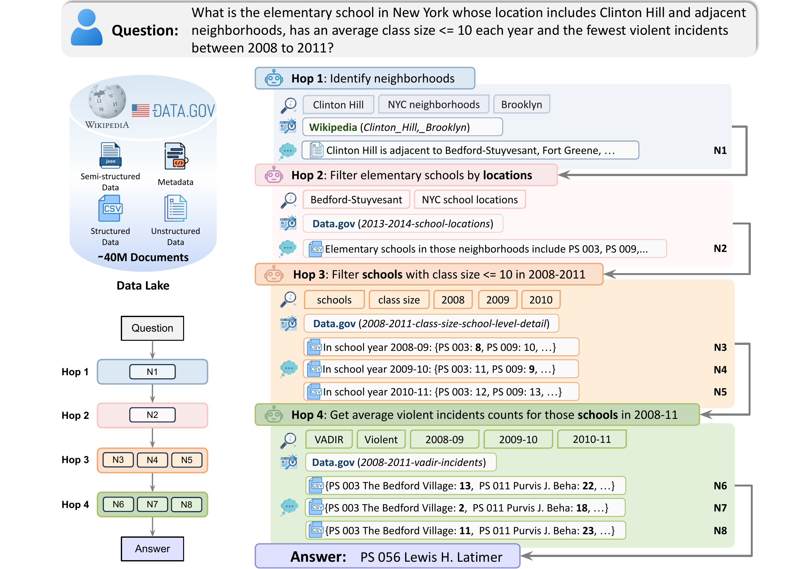

# LakeQA

LakeQA contains benchmark tasks under `lakeqa_mini/` and `lakeqa_full/`; and evaluation code under
`evaluation/`. Each task JSON lists the data files it needs in the
`datasets_used` field.

## Description

LakeQA is a benchmark for evaluating deep research agents on complex,
real-world question answering. Unlike benchmarks that hand the model a
relevant passage or rely mostly on familiar Wikipedia facts, LakeQA requires an
agent to do the whole research workflow: identify what evidence is missing,
find the right public sources, inspect tables or documents, carry constraints
across multiple hops, compute intermediate results, and decide when it has
enough evidence to answer.

The benchmark is designed to stress both **search** and **reasoning**. A task may require combining information from public datasets,
metadata files, and reference documents. This makes success depend not only on reasoning after retrieval, but also on whether the agent can find and inspect the correct evidence in the first place.



## Downloading Task Data From S3

The task data is stored in the S3 bucket:

```bash
lakeqa-yc4103-datalake
```

Install the small command-line dependencies:

```bash
brew install awscli jq
```

If the bucket is available publicly, use `--no-sign-request`. If your
environment requires credentials, omit `--no-sign-request` and run
`aws configure` first.

### Example Task

Use `lakeqa_mini/k-1-d-1/task_1.json` as a small example:

```bash
jq '.datasets_used' lakeqa_mini/k-1-d-1/task_1.json
```

That task includes keys such as:

```text
datagov/vsrr-provisional-drug-overdose-death-counts/files/rows.txt
datagov/vsrr-provisional-drug-overdose-death-counts/signed-metadata.txt
datagov/vsrr-provisional-drug-overdose-death-counts/files/FINALVERSION_NVSS_methods_drug_adjustment_June_Release.pdf
```

Download one file manually:

```bash
mkdir -p data/datagov/vsrr-provisional-drug-overdose-death-counts/files

aws s3 cp --no-sign-request \
  s3://lakeqa-yc4103-datalake/datagov/vsrr-provisional-drug-overdose-death-counts/files/rows.txt \
  data/datagov/vsrr-provisional-drug-overdose-death-counts/files/rows.txt
```

Download every file listed by a task:

```bash
TASK=lakeqa_mini/k-1-d-1/task_1.json
BUCKET=lakeqa-yc4103-datalake

jq -r '.datasets_used[]' "$TASK" | while read -r key; do
  mkdir -p "data/$(dirname "$key")"
  aws s3 cp --no-sign-request "s3://$BUCKET/$key" "data/$key"
done
```

After this, the task's files are available locally under `data/`, preserving
the same relative paths as `datasets_used`.

To use another task, change only `TASK`, for example:

```bash
TASK=lakeqa_mini/k-3-d-1/task_1.json
```
